# Experiment 6: Very Simple Switching
An electric switch is a **basic component that opens and closes a circuit, controlling the flow of electricity to devices.**

An electrical schematic is a **map of an electronic circuit that uses abstract, standardized symbols to show how components are connected.**

## Basic Schematic Symbols
Identify these basic schematic symbols.

| |  | |
| :---: | :---: | :---: |
| 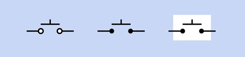 | 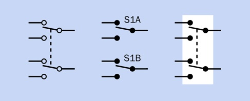 | 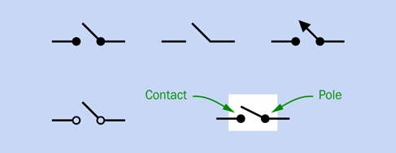 |
| 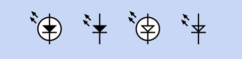 | 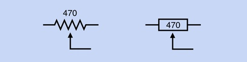 | 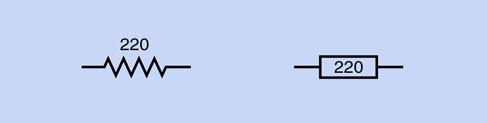 |
| 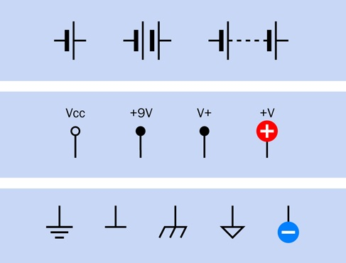 | 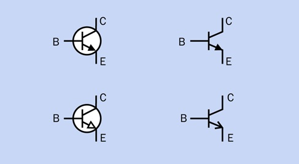 | 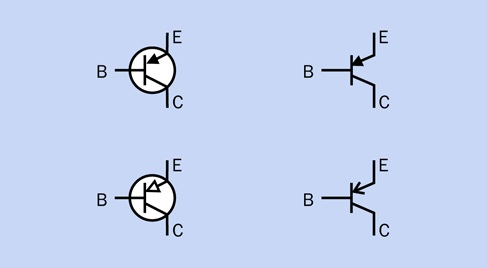 |
| 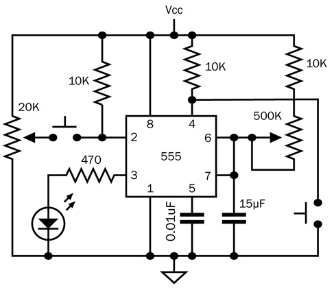 |  | 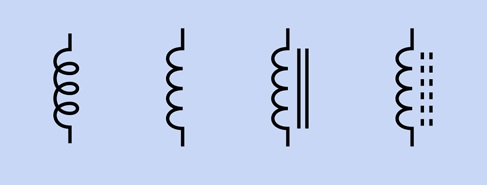 |

## Build a Stairway Switch
Using the schematic below, create a "stairway switch".

| Starway Diagram | Stairway Switch Schematic |
| :---: | :---: |
| 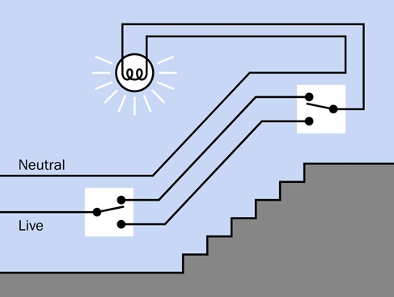 | 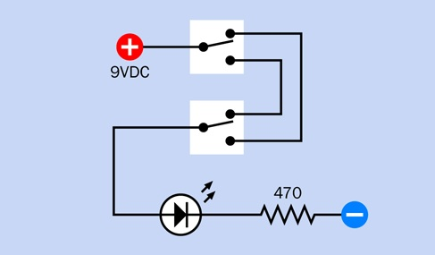 |

