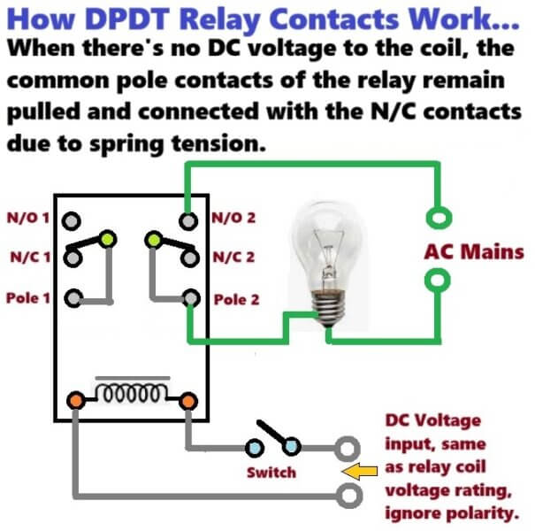
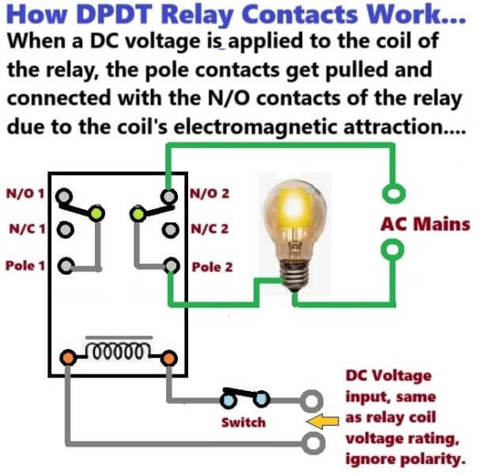
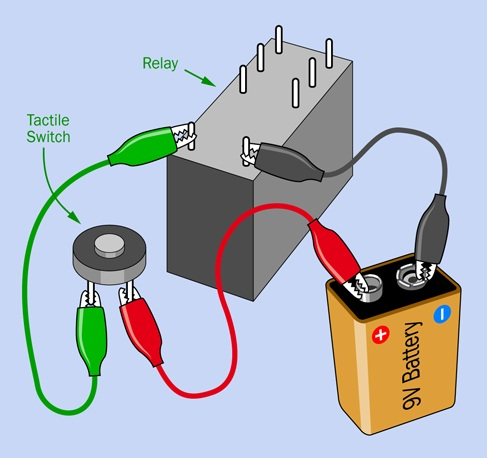
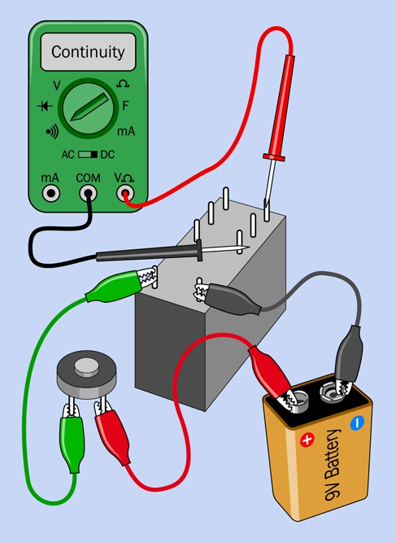
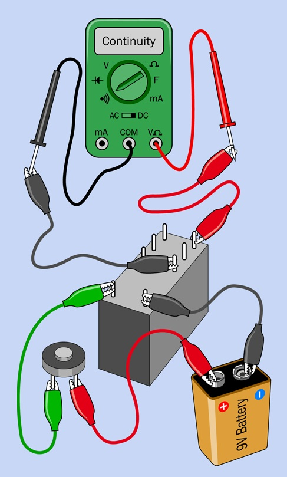
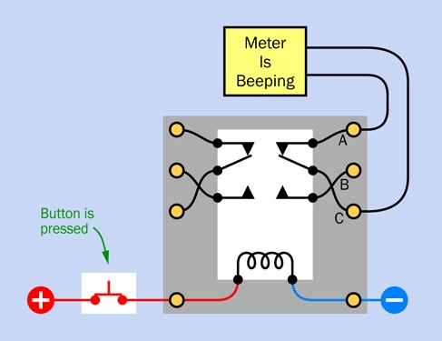

# Experiment 7: Investigating a Relay
The term **relay** primarily refers to the act of passing something (like a message, object, or signal) forward in stages.
In Electronics & engineering, a relay is a electromagnetic switch.
It uses a small, low-power electrical signal to control a much larger,
high-voltage circuit (like turning on a car's starter motor or lights using a dashboard switch).

The type of relay we are using have two pins at one end and six at the other.
The six are clustered in two lines of three.

Relays can also be used for computing!
The very first electrical computers (1937 ~ 1944) where made with relays doing all the arithmetic.
The relays where eventually replaced by vacuum tubes and then transistors.

>**NOTE:** Some relays are fussy about the way that you apply voltage, so you must get the +/- polarity right.
>Everything works fine with the electricity flowing one way
>through the coil, but if you reverse the positive and negative connections
>(in other words, if you reverse the polarity) the relay stops working.

## How Does The Relay Work

| |  |
| :---: | :---: |
|  |  |

## Explore How The Relay is Configured
Build & test each one of these circuits and explain why you got your measurements.

| |  | |
| :---: | :---: | :---: |
|  |  |  |

## What’s Going On Inside
What’s going on inside?
Here is a diagram and let's take a look inside too.

