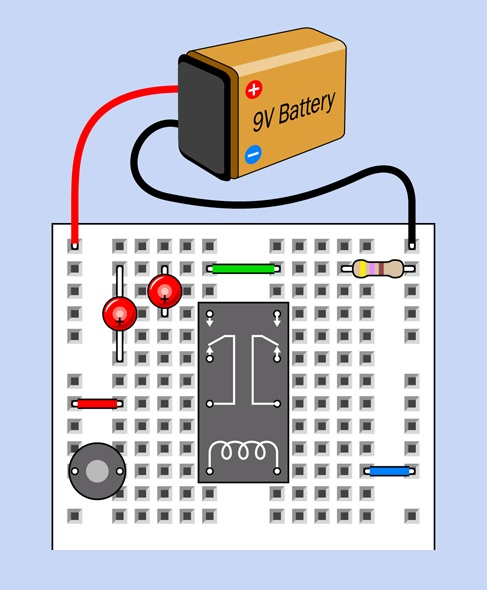
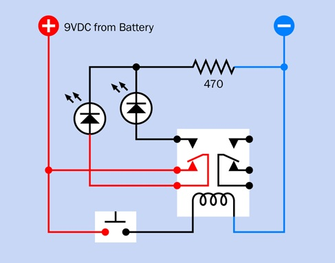
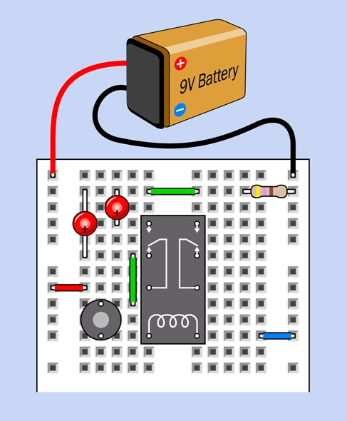
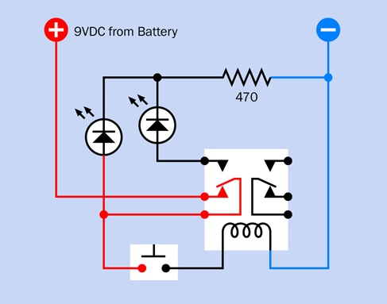

# Experiment 8: A Relay Oscillator
A relay oscillator is **a simple, self-interrupting circuit that uses the physical contacts of an electromechanical relay to turn itself on and off repeatedly**.
It operates on a feedback loop where the relay coil powers on, breaks its own connection, shuts off, and resets, creating continuous oscillations
(often heard as a loud buzzing or clicking).

## Relay With Status Lights
Do the following:
1. Assemble the breadboard circuit below.
1. Power it by pressing the button.
1. What do you see?  What to do you hear?
1. Explain what is going on?

| Breadboard Diagram | Schematic |
| :---: | :---: |
|  |  |

## Build a Relay Oscillator
Do the following:
1. Assemble the breadboard circuit below.
1. Power it by pressing the button.
1. What do you see?  What to do you hear?
1. Explain what is going on?

| Breadboard Diagram | Schematic |
| :---: | :---: |
|  |  |

## Adding a Capacitor for Control
In its raw form, the relay switches incredibly fast, which will physically wear out or damage the contacts very quickly.
To make the oscillation useful, a capacitor is added across the relay coil.
The capacitor acts like a tiny rechargeable battery; when the switch cuts off power,
the capacitor temporarily discharges its stored energy to keep the coil energized for a fraction of a second.
This slows the circuit down, creating a steady, controllable on-and-off pulse.

Do the following:
1. Place a 1,000 µF electrolytic capacitor across the relay coil
1. Place a 2,200 µF electrolytic capacitor
1. Place a 4,700 µF electrolytic capacitor

These new concepts are whispering in your ear:
* relays take on two states: on / off - logic
* feeding you output into you input create novel behaviors - feedback
