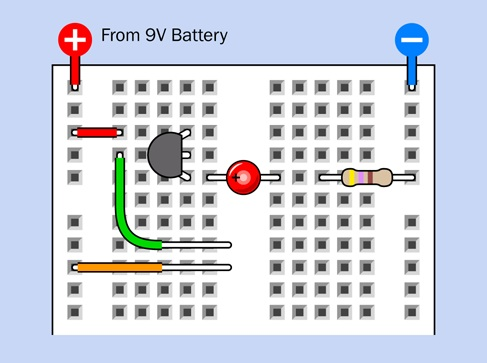
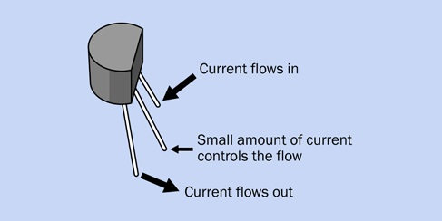
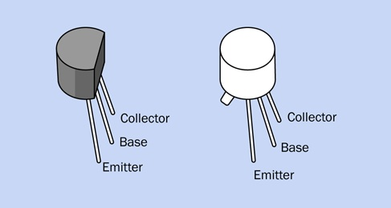
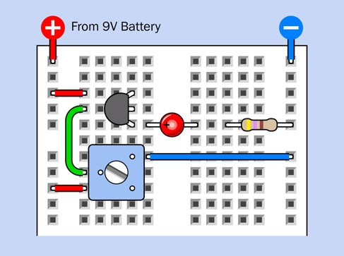
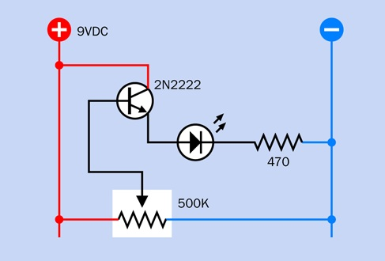
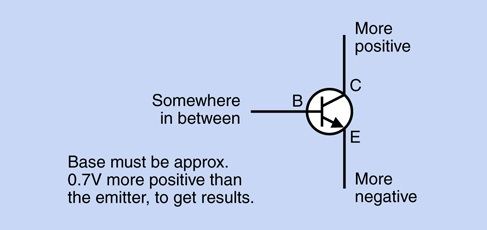
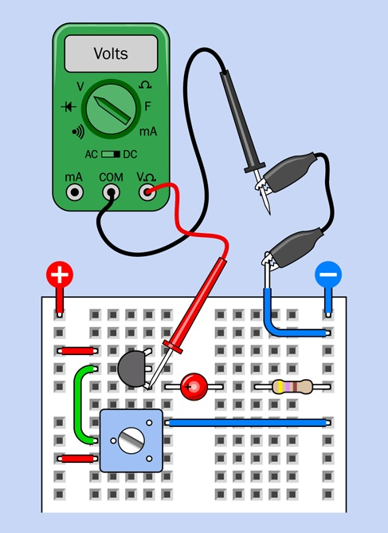

# Experiment 10: Transistor Switching
**WARNING:** Transistors are easily damaged, and the damage will be permanent.
* Never apply a power supply directly between any two pins of a transistor.
  You can burn it out with too much current.
* Always limit the current flowing between the collector and the emitter of a
  transistor by using another component such as a resistor, in the same way you
  would protect an LED.
* Don’t apply voltage in reverse orientation. The collector of an NPN transistor
  should always be more positive than the base, which should be more positive
  than the emitter.

## The Finger Test
We'll show that a transistor can amplifying the tiny amount of current flowing through your finger.

**What you will need** 
* Transistor, 2N2222
* Generic LED
* Resistors: 470 ohms
* 9-volt battery and connector

**Do the following**
1. Assemble the breadboard circuit below.
1. Press your finger to the exposed metal wire, while you watch the LED.
   If nothing happens, moisten your finger slightly and try again.
   When you press harder, what happens to the LED?.
1. What do you see?
1. Explain what is going on?

| Breadboard Diagram | Explainer |
| :---: | :---: |
|  |   |

_pages 223 - 225_

This phenomenon is very different from the behavior of the capacitor that you saw in the previous experiment.
A capacitor just passed a quick pulse of electricity.
A transistor controls a steady flow.
The component that you’re using in this experiment is a bipolar transistor.

It comes in two variants named NPN and PNP.
The NPN type, which you have been using, contains three layers of silicon,
of which two “N” layers have a surplus of negative charge carriers.

* When the base of an NPN transistor is slightly more positive than its emitter,
  the transistor allows positive current to flow in through the collector and out through the emitter.
* In this way, a very small current entering through the base of the transistor
  can control a larger current entering through the collector.

A PNP transistor functions oppositely to an NPN transistor.
It allows negative current to flow in through the collector
and out through the emitter when the base is slightly more negative than the emitter.

## Adding a Potentiometer
To learn more about the way in which a transistor works,
we need a component that is a little more controllable than the tip of your finger.
We will use a potentiometer will do the job, specifically a trimmer potentiometer.

**What you will need** 
* Transistor, 2N2222
* Generic LED
* Resistors: 470 ohms, 1M ohms, 500K ohms Trimmer Potentiometer
* 9-volt battery and connector

**Do the following**
1. Assemble the breadboard circuit below.
1. What do you see?
1. Explain what is going on?

| Breadboard Diagram | Schematic |
| :---: | :---: |
|  |   |

_pages 230 - 232_

The potentiometer is connected between the positive bus and the negative bus.
In this orientation we call it a voltage divider.

* When the wiper is at one end of the track, it connects directly with the positive side of the power supply.
* At the other end of the track, it connects directly with negative ground.
* At positions in between, it divides the voltage.

Potentiometers are often used in this way, to provide a full range of voltages.

## Transistor Current Amplifier
You’ve seen that the voltage at the base of a bipolar transistor controls the output
from the transistor. Does that mean the transistor is amplifying the voltage?

**Do the following**
1. Assemble the breadboard circuit below.
1. What do you see?
1. Explain what is going on?

| Breadboard Diagram | Explainer |
| :---: | :---: |
|  |  |

_pages 230 - 232_

**What Do You Discovery?** 
This particular transistor amplifies the current entering its base by a factor of more than 200:1.
This is called the **beta value** of a transistor, and leads me to a fundamental fact:
A bipolar transistor amplifies current, not voltage.

