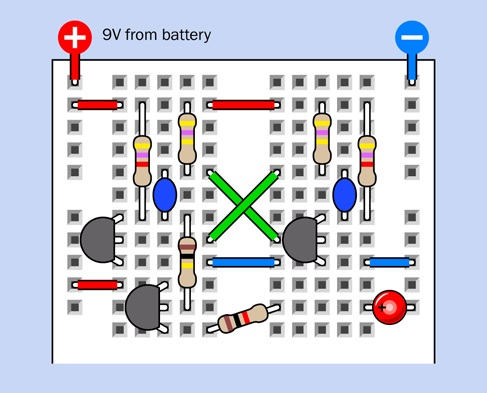
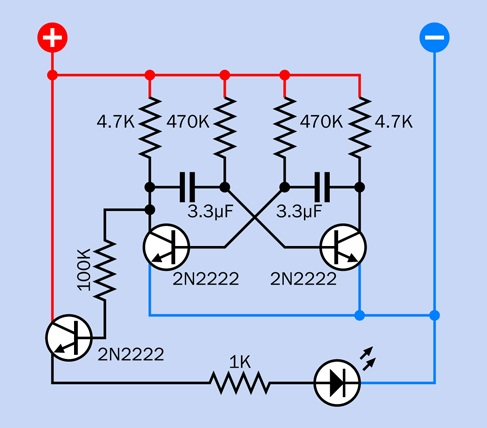
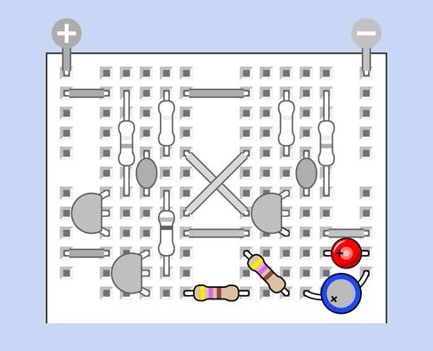
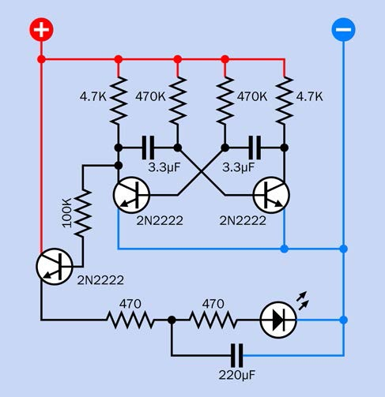

# Experiment 11: Light and Sound

## Oscillator Circuit
There’s not a lot of room among the components in this project,
so you may find that it’s easier to install them using your pliers instead of your fingers.
Count the holes in the board carefully,
and double-check to make sure that everything is in exactly the right place.

**What you will need** 
* Transistors: 2N2222 (6)
* Resistors: 470 (2), 1K (1), 4.7K (4), 100K (2), 220K (2), 470K (4)
* Capacitors: 0.01µF (2), 0.1µF (2), 0.33µF (2), 1µF (1), 3.3µF (2), 33µF (1), 100µF (1), 220µF (1)
* Generic LED (1)

**Do the following**
1. Assemble the breadboard circuit below.
1. What do you see?
1. Explain what is going on?

| Breadboard Diagram | Schematic |
| :---: | :---: |
|  |  |

## RC Network Controlled Oscillator Circuit
You’ve learned that two transistors can create a signal that pulses on & off,
and a third transistor can amplify it to power an LED.
What have you learned from previous experiments that you might be able to apply to this one?
The output is fluctuating quite slowly.
We can make it more interesting by adding an RC network.

**What you will need** 
* Transistors: 2N2222 (6)
* Resistors: 470 (2), 1K (1), 4.7K (4), 100K (2), 220K (2), 470K (4)
* Capacitors: 0.01µF (2), 0.1µF (2), 0.33µF (2), 1µF (1), 3.3µF (2), 33µF (1), 100µF (1), 220µF (1)
* Generic LED (1)

**Do the following**
1. Assemble the breadboard circuit below.
1. What do you see?
1. Explain what is going on?

| Breadboard Diagram | Schematic |
| :---: | :---: |
|  |  |

*pages 249*

