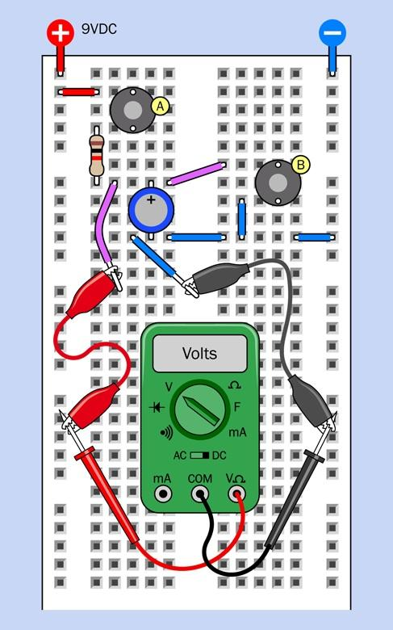
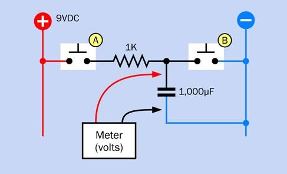
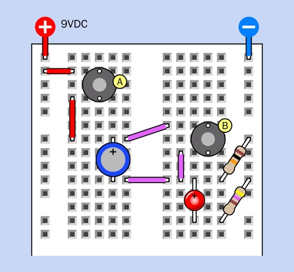
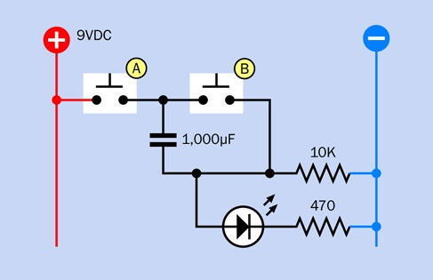
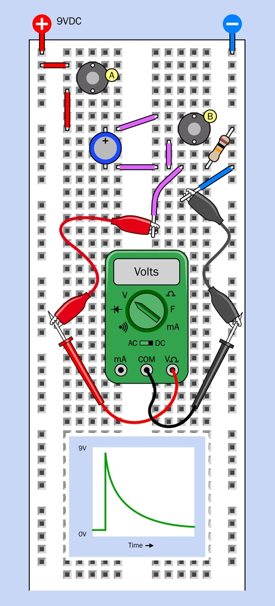
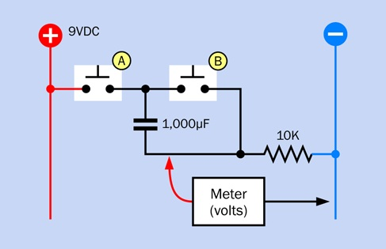
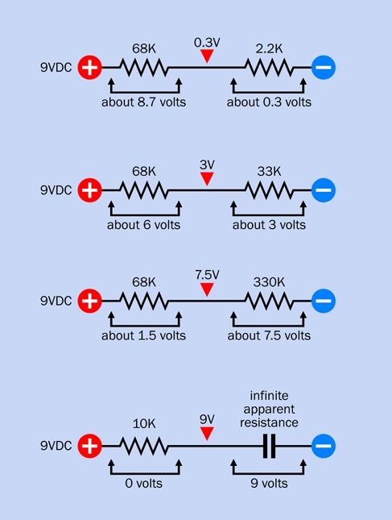

# Experiment 9: Time & Capacitors
Electrons travel almost at the speed of light,
yet we can use them to measure time in seconds, minutes, or even hours.
This experiment will show you how.

One of the first statements you will find, when you read any introductory electronics text, is: A capacitor blocks DC (direct current).
Is this true ... sort of.  Let's find out.

**What you will need** 
* Breadboard, hookup wire, wire cutters, wire strippers, test leads, multimeter
* 9-volt battery and connector (1)
* Tactile switches (2)
* Generic LED (1)
* Resistors: 470 ohms, 1K, 10K (one of each)
* Capacitors: 0.1µF, 1µF, 10µF, 100µF, 1,000µF (one of each)

## Timing the Charging of a Capacitor
You are going to built a RC network (R for resistor, C for capacitor) and explore the following:
* Did the capacitor take exactly 10 times as long to reach 9 volts when you used the 10K resistor instead of the 1K resistor?
* Did the voltage across the capacitor rise at a steady rate, or did it increase faster at the beginning of the experiment—or toward the end?
* If you wait long enough, will the capacitor ever reach the initial value that you measured as the voltage of your battery?

**Do the following**
  1. measure volts, if it’s less than 9.2V, you need a newer battery
  1. build the circuit, a 1K resistor, and a 1,000µF capacitor are needed
  1. connect 9VDC supply on the two buses of the breadboard
  1. if meter measures more than 0.1V, pressing button B
  1. hold down button A while you count the seconds the capacitor takes to charge to 9.0V (typically over 3 sec.)
  1. disconnect the battery and remove the 1K resistor and substitute a 10K resistor
  1. repeat steps above

| Breadboard Diagram | Schematic |
| :---: | :---: |
|  |  |

_pages 198 - 199_

## Capacitive Coupling
We are going to explore the following:
* press button A, and—why did the LED just flash and slowly fade away?
* It is often said that capacitor blocks DC (direct current). But the LED flashed, so what is going on in this circuit?

Do the following:
1. Discharge the capacitor by pressing button B, and then check the reading on your meter. It should be near zero volts.
1. Watch your meter very carefully while you press button A.
1. The way that a capacitor allows a sudden fluctuation in voltage to pass through is well known, and is often used in electronics. But how can it happen?
1. Explain what is going on?

| Breadboard Diagram | Schematic |
| :---: | :---: |
|  |  |

_pages 209 - 211_

**Capacitive coupling** is the transfer of energy between two separate electrical circuits through an electric field.
By utilizing a capacitor or unintentional overlapping conductors,
it allows alternating current (AC) signals to pass while entirely blocking direct current (DC).

## Displacement Current
The way that a capacitor allows a sudden fluctuation in voltage to pass through is well known, and is often used in electronics.
An inrush of current creates a field effect inside the capacitor, and the field effect can induce voltage on the opposite plate.

Do the following:
1. Assemble the breadboard circuit below.
1. Power it by pressing the button.
1. What do you see?
1. Explain what is going on?

| Breadboard Diagram | Schematic |
| :---: | :---: |
|  |  |

_pages 213 - 214_

When you have a pair of resistors in series, and the left one is connected with
the power supply while the right one is connected with negative ground, the voltage between
the resistors increases as the value of the righthand resistor increases.
A capacitor has an almost infinite effective resistance to DC current,
so all voltage is across the capacitor and zero across the resister.

  

**Displacement current** is a theoretical quantity representing a changing electric field, rather than moving physical charges.
Introduced by James Clerk Maxwell, it acts exactly like a real electrical current to produce a magnetic field,
and it is the physical mechanism that allows electromagnetic waves (like radio and light) to travel through space.

