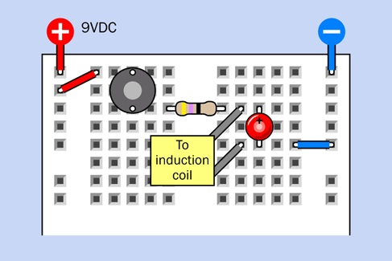
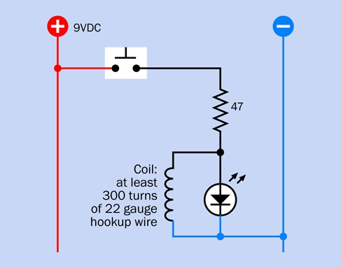
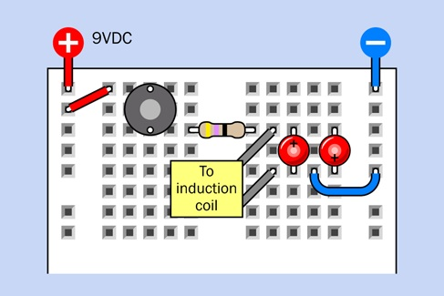
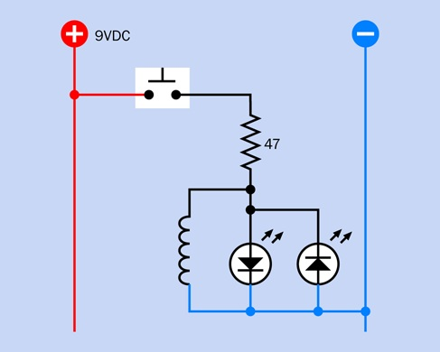

# Experiment 28: Making a Coil React
You’ve seen that when you pass current through a coil, the current creates a magnetic field.
When you disconnect the current, what happens to the field that it created?

The energy in the field is converted back into a brief pulse of electricity.
We say that this happens when the field collapses.
This experiment will enable you to see it for yourself.

**What you will need** 
* Breadboard, hookup wire, wire cutters, wire strippers, multimeter
* Low-current LEDs (2)
* 22-gauge hookup wire or 26-gauge magnet wire, 100 feet (1 spool)
* Resistor, 47 ohms (1)
* Tactile switch (1)

## Build This 1st
**Do the following** 
1. Assemble the breadboard circuit below.
1. Power it by pressing the button.
1. Each time you press the button, the LED blinks briefly. Can you explain why that should be?

| Breadboard Diagram | Schematic |
| :---: | :---: |
|  |  |

_pages 648_

**What you observe** 
When you look at the schematic, it doesn’t seem to make much sense.
The 47-ohm resistor seems too small to protect the LED
but why should the LED light up at all, when the electricity can go around it through the coil?

## Build This 2nd
Try adding a second LED, but wired in the opposite direction as illustrated below:

**Do the following** 
1. Assemble the breadboard circuit below.
1. Power it by pressing the button.
1. Each time you press the button, the first LED flashes, as before.
   But now when you release the button, the second LED flashes.

| Breadboard Diagram | Schematic |
| :---: | :---: |
|  |  |

_pages 649 - 650_

**What you observe** 
Press the button again, and the first LED flashes, as before.
But now when you release the button, the second LED flashes.

## A Collapsing Field
Here’s what happened during this experiment.
1. At first, the coil required a brief amount of time to build up a magnetic field.
   This took a moment, and during that moment the coil blocked some of the flow of current.
   As a result, some of the current detoured through the first LED.
2. Once the magnetic field was established, current flowed through the coil more normally.
   The low resistance path is the coil and the LED turns-off.
3. When you disconnected the power, the magnetic field collapsed,
   and the energy from the field was converted back into electricity in a short, brief pulse.
   This caused the second LED to flash when you let go of the button.

The three primary types of passive components in electronics are
resistors, capacitors, and inductance:
* A **resistor** constrains current flow, and drops voltage.
* A **capacitor** allows a pulse of current to flow initially, but blocks direct current.
* A **inductor** (the coil) blocks DC current initially, but allows a continuing flow of direct current.

