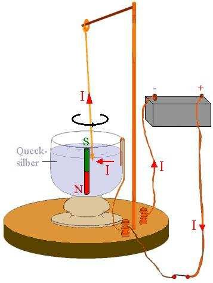
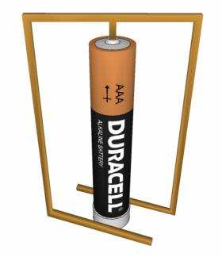
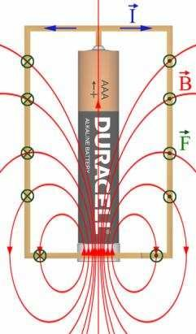
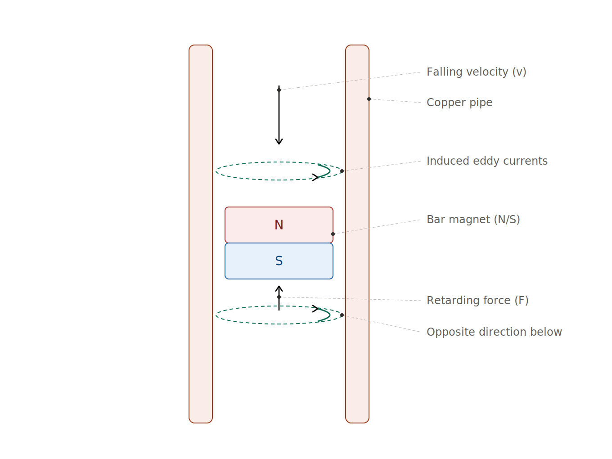

# Bonus Experiments

## Faraday's First Motor
In the early 1800's, Michael Faraday's was the first to show how to transform electrical energy into continuous mechanical motion.
Today we would call it a "motor" but Faraday never call it that; he called it a "electro-magnetic rotational apparatus".
When Faraday published his findings in 1821, he was demonstrating the conversion of electrical current into mechanical force,
but his terminology did not yet include "motors," "generators," or "currents" as we use those words today.

  

We are going to repeat Faraday's motor experiment, without using a pool of mercury, making it much safer.

**What you will need** 
* 12 inches of pure copper wire
* 1 AA Battery
* 2 Neodymium Round Magnet, 1/2" diameter x 1/4" height

**Do the following** 
This video shows how to make your very own "Faraday" electric motor - <https://www.youtube.com/watch?v=lwn15-Ze2b4>

| single pole motor | current / magnesium / force |
| :---: | :---: |
|  |  |

Source: *Modelling and Simulation of a Simple Homopolar Motor of Faraday’s Type*

----

## Eddy Current Braking
You'll see this used on roller coast's and trains to provide smooth, contact-free braking.

**What you will need** 
* 3/4 inch inside diameter copper pipe, 18 inches long
* 2 Neodymium Round Magnet, 1/2" diameter x 1/4" height

**Do the following** 
1. Attached the magnet together
1. Drop the magnets down the pipe
1. Explain what is going on?

  

When a conductor moves relative to a magnetic field (or the field changes near a conductor),
this action induced circulating currents ("eddies") form in the conductor.
Per Lenz's law, these currents oppose the relative motion, creating a drag force

Three laws working together:

1. **Faraday's Law of Induction** — As the magnet falls, its moving magnetic field changes the flux through the copper.
   A changing flux induces a voltage (EMF) in the pipe.
1. **Lenz's Law** — The induced current always opposes the change that created it.
   So the induced current generates its own magnetic field pointing to resist the magnet's motion — braking it.
1. **Ohm's Law / Joule Heating** — Copper isn't a superconductor, so the induced "eddy currents" meet resistance, dissipating energy as heat.
   That energy comes from the magnet's kinetic energy — hence the slowdown.

The net effect is a velocity-dependent retarding force,
so the magnet reaches a terminal velocity rather than accelerating freely under gravity.

If the pipes wall thickness is greater, the breaking becomes greater, but only to a point.
That is because induced currents don't distribute evenly through the wall;
they concentrate near the surface.
The current in the walls only penetrates to a "skin depth",
and the skin depth depends on the conductor's resistivity and the rate of field change (magnet's speed).

----

## Battery Train
* [The Brilliant Science Behind the Homopolar Battery Train]<https://www.youtube.com/watch?v=1TAMpaZRYqY>
* [This Battery Train Goes UP, Not Sideways!]<https://www.youtube.com/watch?v=zpcZTd6ViUo>

| Item | Spec | Notes |
|------|------|-------|
| AA batteries | 1.5V alkaline | Energizer/Duracell work best |
| Neodymium disc magnets | 1/2" dia, N52 grade | 4–6 per magnets, stacked |
| Copper wire coil | 20–22 AWG, bare copper | ~10–15 ft for a decent tunnel |

----

