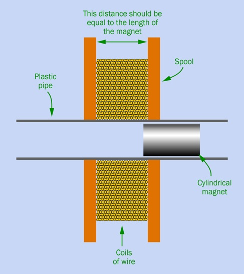
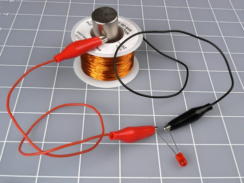
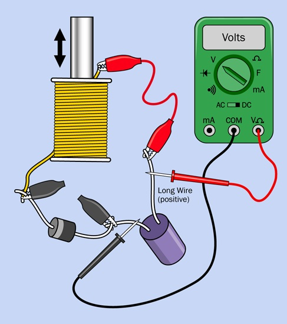
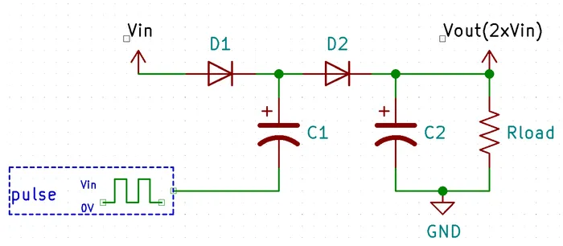

# Experiment 26: Tabletop Power Generation
This is a modification to the 26th experiment in
[*Make: Electronics, 2nd Edition* by Charles Platt](https://someplace-else.neocities.org/books/Make%20Electronics%202nd%20Edition.pdf).
I'm using supplies easily purchased from online sources
and creating the required solenoid (aka coiled wire).

## Tabletop Power Generation
**What you will need** 
Create a Coil Generator:
* Wire cutters, wire strippers, test leads, multimeter
* [rigid tubing][02] 1/2 Inch(13mm) ID x 5/8 Inch(16mm) OD x 1Ft(305mm) Length
* [magnetic wire][01], 26 AWG (aka 26-gauge), total 200 feet
* [N52 Neodymium Round Magnet][03], 1/2" diameter x 1/4" height - 20 Pack, axially magnetized

**Do the following** 
1. Place 5 neodymium magnets (connected north to south) in the tube
1. Cover the ends with two fingers on one hand
1. Shake the tube so the magnet slides back & forth rapidly, measure the voltage

| generator coil | generator coil with LED |
| :---: | :---: |
|  |  |

*page 629-631*

----

## Charging Capacitor
**What you will need** 
* Coil Generator
* Low-current LED (1)
* Capacitor, 1,000µF (1)
* Switching diode, 1N4001 or similar (1)

**Do the following** 
1. Assemble the diagram below
1. Shake the coil generator to charge the capacitor
1. Read the voltmeter after several shakes and then continue

  

*page 636*

When you shake the gnerator coil, your mechanical energy is converted to electrical energy that is stored in the capacitor.
The generic name for this circuit is "charge pump circuit".

  

----

>**Note:** **Magnet Wire**
>is a copper or aluminum conductor coated with a microscopic layer of polymer film insulation.
>Its ultra-thin jacket maximizes turn density in tight spaces, allowing it to generate strong magnetic fields
>for electromagnets, motors, transformers, and guitar pickups without short-circuiting.
>
>**Note:** The **Right-Hand Thumb Rule**
>helps you determine the direction of the magnetic field wrapping around a current-carrying wire.
>Point your right thumb in the direction of the current (positive to negative);
>your curled fingers will point in the circular direction of the magnetic field.
>
>**Note: The Solenoid Rule (Coiled Wire)**
>For wires wound into a coil or electromagnet, the roles of your thumb and fingers reverse:
>* Fingers: Curl in the direction the current flows around the loops.
>* Thumb: Points toward the North pole of the magnetic field inside the coil.
>
>**Note: The Magnetic Force on a Wire (Right-Hand Palm Rule)**
>If a current-carrying wire is placed inside an existing magnetic field, it will experience a force.
>* Fingers: Point in the direction of the magnetic field lines (North to South).
>* Thumb: Points in the direction of the electric current.
>* Palm: Pushes or faces in the direction of the magnetic force exerted on the wire.

----

[01]:https://www.amazon.com/dp/B08N1FCMV9?th=1
[02]:https://www.amazon.com/dp/B0DMN6L2FH?th=1
[03]:https://www.amazon.com/dp/B0DN1G9ZST

