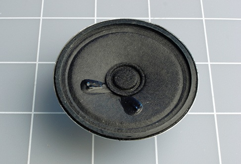
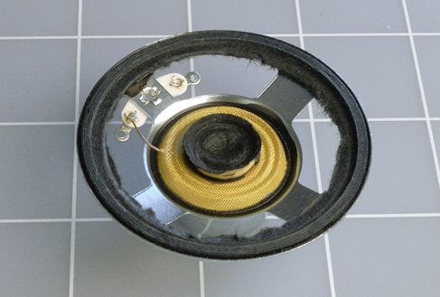
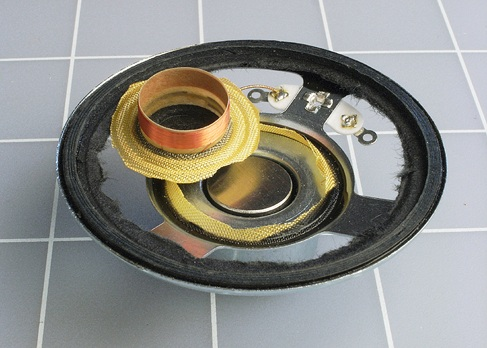

# Experiment 27: Loudspeaker Destruction
You saw in an earlier experiment that electricity running through a coil
can create enough magnetic force to pull a small metallic object toward it.
What if the coil is very light, and the object is heavier?
In that case, the coil can be pulled toward the object.
This principle is at the heart of a loudspeaker.

**What you will need** 
* Cheap loudspeaker, 2” minimum (1)
* Utility knife (1)

**Do the following** 
1. Turn the loudspeaker face-up, as shown in the first figure below.
1. Cut around the perimeter of its cone with a sharp utility knife or X-Acto blade.
1. Then cut around the circular center and remove the O-shaped circle of black paper that you’ve created.

| Loud Speaker | Cone Removed | Coil Removed |
|:---:|:---:|:---:|
|  |  |  |

*pages 639*

So we can make use of the electromagnetic principle we learn in two ways:
1. Use a fixed electromagnet to move metallic objects (example use case: pickup paper clips)
2. Use a fixed magnet to moving electromagnet object (example use case: loudspeaker)

